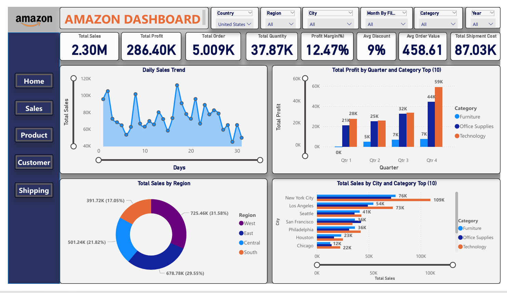
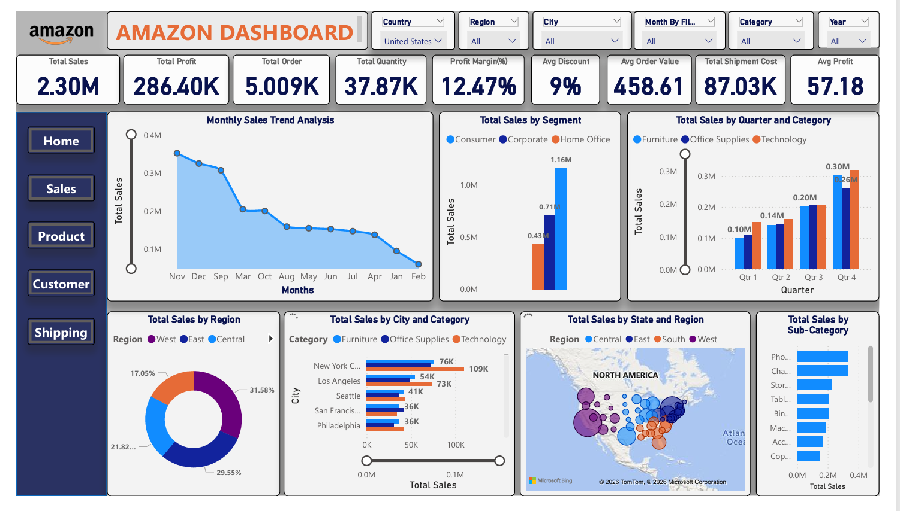
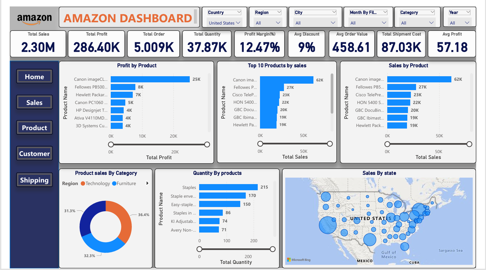
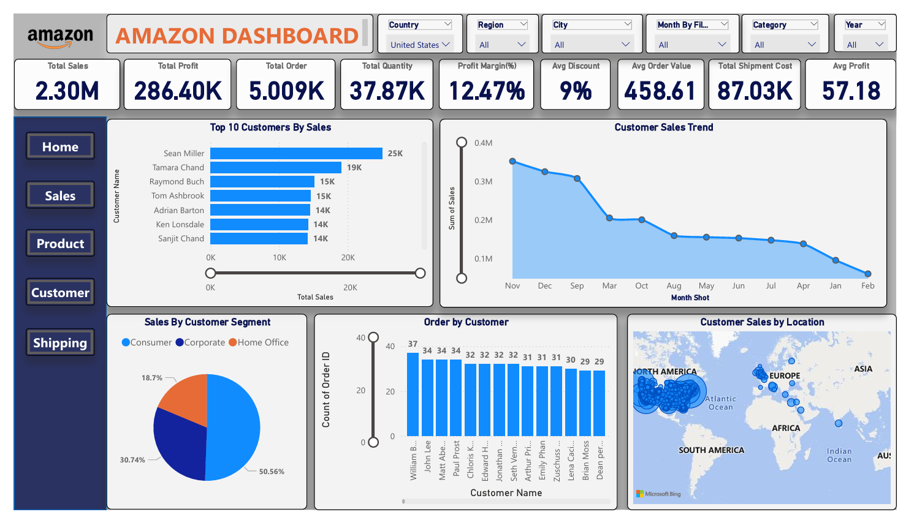
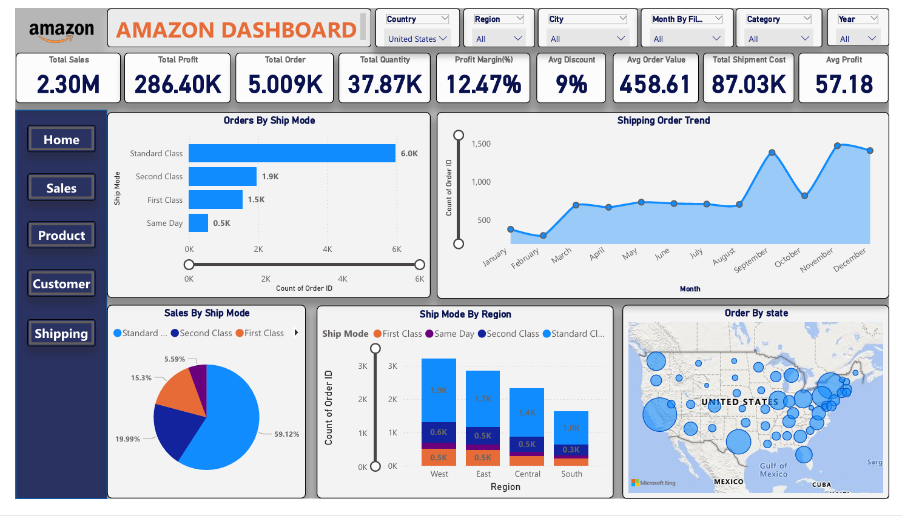

# 📊 Amazon Sales Dashboard (Power BI)

## 📌 Overview
This project presents an interactive Power BI dashboard to analyze Amazon sales performance, identify trends, and generate actionable insights.

---

## 🚀 Project Highlights
- Built interactive dashboard using Power BI  
- Analyzed sales by region, category, and customer  
- Identified top-performing products and customers  
- Visualized monthly sales trends and KPIs  

---

## 🛠 Tools Used
- Power BI  
- Excel  

---

## 📊 Key Insights
- Top-selling products identified  
- Regional sales performance analyzed  
- Monthly sales trends visualized  
- Customer behavior insights extracted  

---

## 📊 Dashboard Preview

### 📌 Main Dashboard

### 📊 Sales Overview

### 📦 Product Analysis

### 👤 Customer Insights

### 🚚 Shipping Overview

---

## 📂 Dataset
- Source: Amazon sales dataset  
- Format: Excel (.xlsx)  
- Includes: Sales, Customer, Product, Region data  

---

## 📌 Conclusion
This dashboard helps businesses understand sales performance and make data-driven decisions using clear visual insights.

