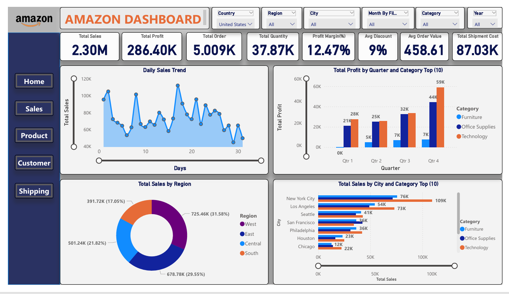
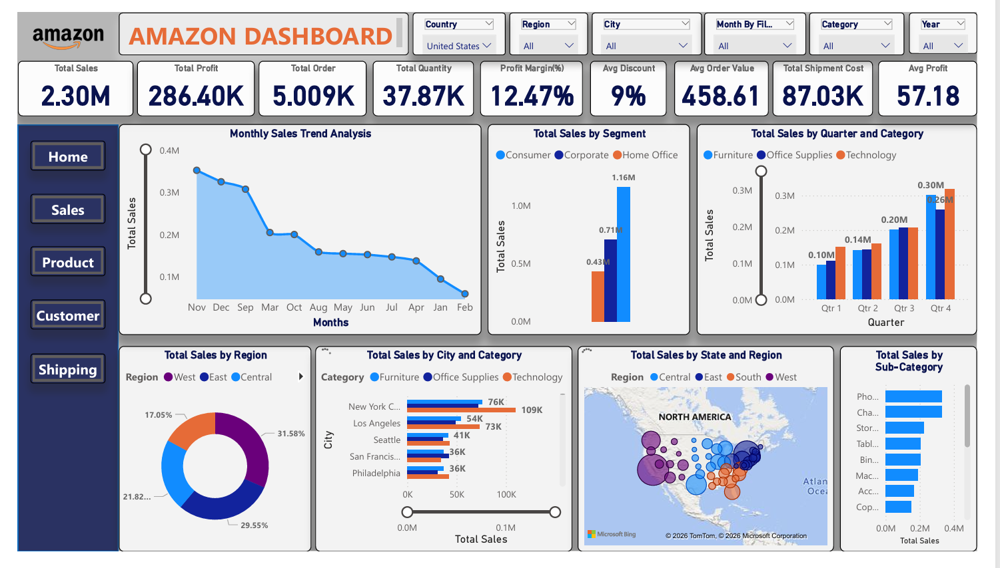
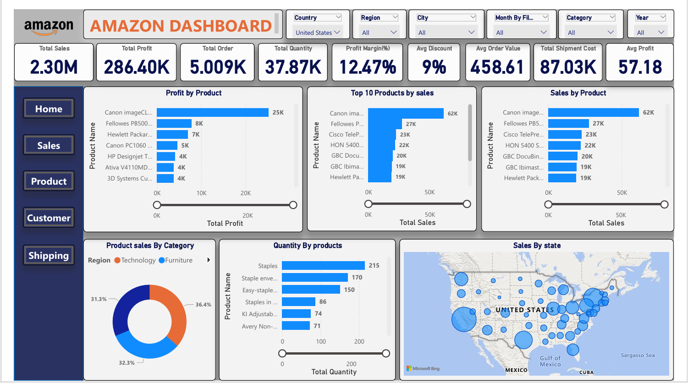
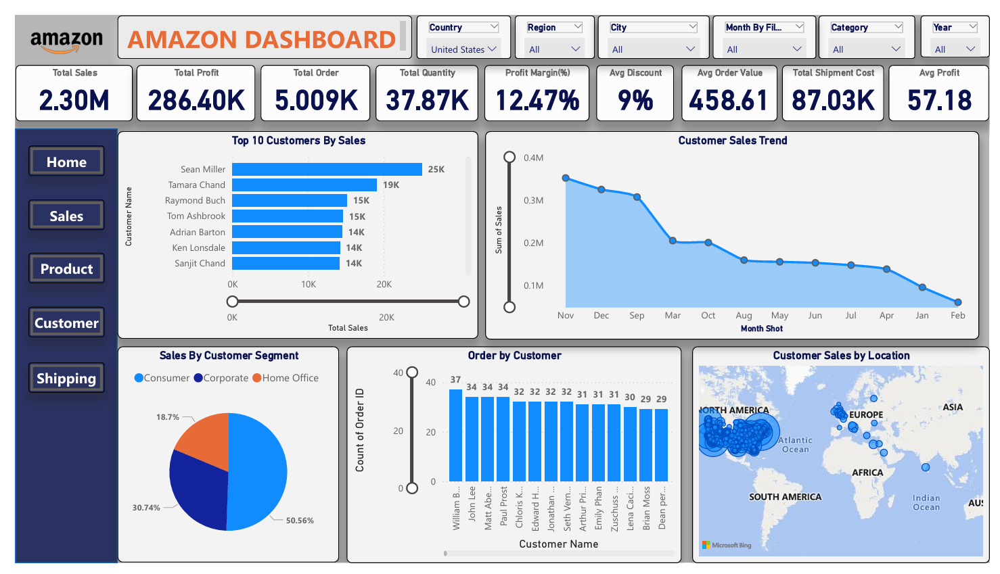
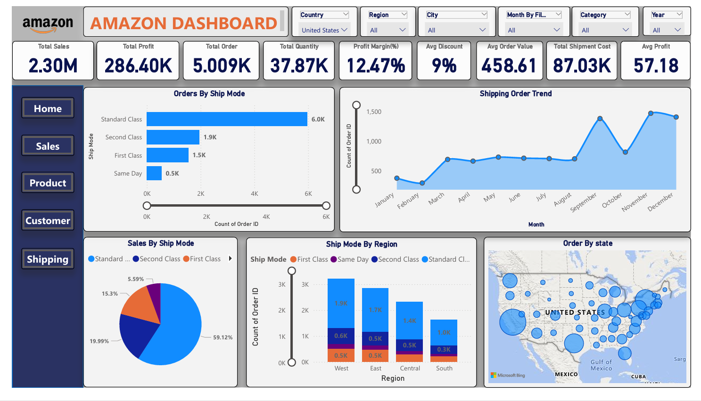

# 📊 Amazon Sales Dashboard | Power BI

Hi! I'm Gautam Kumar, and this is one of my Power BI projects where I worked with Amazon sales data to understand sales performance, products, customers, regions, and shipping patterns.

The main idea behind this project was simple: take raw sales data, analyze it from different angles, and present the important information through an interactive dashboard.

---

## 📌 Project Overview

This project focuses on analyzing Amazon sales data using Power BI and Excel.

The dashboard provides a clear view of:

- Overall sales and profit
- Sales trends over time
- Product performance
- Customer performance
- Regional and city-wise sales
- Category and sub-category performance
- Shipping methods and order trends

Interactive filters are used throughout the dashboard so that the data can be explored based on different countries, regions, cities, categories, months, and years.

---

## 🎯 Project Objectives

The main objectives of this project were to:

- Understand overall sales performance
- Track sales and profit
- Identify top-performing products
- Analyze customer contribution
- Compare regional and city-wise performance
- Understand sales trends over time
- Analyze shipping order patterns
- Present business information in an easy-to-understand dashboard

---

## 🛠️ Tools & Technologies

- **Power BI** – Dashboard development and data visualization
- **Power Query** – Data cleaning and transformation
- **DAX** – Calculations and measures
- **Microsoft Excel** – Dataset and data preparation

---

# 📊 Dashboard Pages

## 🏠 1. Main Dashboard

The Main Dashboard gives a quick summary of the overall business performance.

### Key KPIs

- Total Sales: **2.30M**
- Total Profit: **286.40K**
- Total Orders: **5.009K**
- Total Quantity: **37.87K**
- Profit Margin: **12.47%**
- Average Discount: **9%**
- Average Order Value: **458.61**
- Total Shipment Cost: **87.03K**

The page also includes sales trends, profit by category, regional sales, and city-wise sales.

---

## 📈 2. Sales Overview

The Sales Overview page focuses on understanding how sales are performing across different dimensions.

It includes:

- Monthly Sales Trend
- Sales by Customer Segment
- Sales by Quarter and Category
- Sales by Region
- Sales by City and Category
- Sales by State and Region
- Sales by Sub-Category

This page makes it easier to compare different markets and understand changes in sales over time.

---

## 📦 3. Product Analysis

The Product Analysis page looks at product-level performance.

It includes:

- Profit by Product
- Top 10 Products by Sales
- Sales by Product
- Product Sales by Category
- Quantity by Product
- Sales by State

This analysis helps identify products with strong sales and understand how different products contribute to overall performance.

---

## 👥 4. Customer Insights

The Customer Insights page focuses on customer-level analysis.

It includes:

- Top 10 Customers by Sales
- Customer Sales Trend
- Sales by Customer Segment
- Orders by Customer
- Customer Sales by Location

This helps identify important customers and understand their contribution to the overall business.

---

## 🚚 5. Shipping Overview

The Shipping Overview page analyzes shipping and order patterns.

It includes:

- Orders by Ship Mode
- Shipping Order Trend
- Sales by Ship Mode
- Ship Mode by Region
- Orders by State

The dashboard shows that **Standard Class** is the most frequently used shipping mode in the analyzed data.

---

# 🔍 Analysis & Key Insights

After exploring the dashboard, I found several useful patterns in the data.

### 💰 Overall Performance

The dashboard shows approximately **2.30M in total sales** and **286.40K in total profit**, with a profit margin of around **12.47%**.

This gives a quick picture of the overall financial performance represented in the dataset.

### 📦 Product Performance

The Product Analysis page shows that sales and profit are not evenly distributed across products.

A few products contribute significantly more to sales than others. Identifying these products can help businesses understand which products have stronger demand.

### 🌎 Regional Performance

Sales vary across different regions and cities.

The regional and city-wise visuals make it easier to identify stronger markets and compare their contribution to total sales.

### 👥 Customer Performance

The Top 10 Customers analysis shows that some customers contribute considerably more sales than others.

Understanding these high-value customers can be useful for customer retention and relationship management.

### 📅 Sales Trends

The monthly and quarterly visuals show that sales change over time.

Looking at these trends can help businesses understand periods of stronger and weaker performance and plan future sales activities accordingly.

### 🚚 Shipping Analysis

Standard Class is the most commonly used shipping mode in the analyzed data.

The shipping page also helps compare order patterns across different shipping methods and regions.

### 📊 Profitability

Looking only at sales does not give the complete picture.

The dashboard also compares sales with profit and profit margin, which helps provide a better understanding of business performance.

---

# 💡 Business Takeaways

Based on the dashboard analysis:

- Focus on products that generate strong sales and profit.
- Identify and retain high-value customers.
- Compare regional performance to find stronger markets.
- Monitor monthly and quarterly sales trends.
- Track profit along with sales instead of looking at revenue alone.
- Understand shipping preferences to improve operational planning.
- Investigate lower-performing products and regions for improvement opportunities.

---

# 📷 Dashboard Preview

### 🏠 Main Dashboard

### 📈 Sales Overview

### 📦 Product Analysis

### 👥 Customer Insights

### 🚚 Shipping Overview

---

# 📂 Dataset

The project uses an Excel-based Amazon sales dataset.

**Format:** `.xlsx`

The dataset contains information related to:

- Sales
- Orders
- Customers
- Products
- Categories
- Regions
- Cities
- States
- Shipping

The dataset used for the project is included in this repository.

---

# 📁 Project Files

| File | Description |
|---|---|
| `AMAZON.xlsx` | Amazon sales dataset |
| `Amazon Sales Dashboard.pbix` | Power BI dashboard file |
| `Dashboard.png` | Main dashboard screenshot |
| `Sales.png` | Sales overview screenshot |
| `Product.png` | Product analysis screenshot |
| `Customer.png` | Customer insights screenshot |
| `Shipping.png` | Shipping overview screenshot |

---

# 🧠 Skills Demonstrated

Through this project, I worked on:

- Data Cleaning
- Data Transformation
- Power Query
- DAX
- Data Analysis
- Data Visualization
- KPI Development
- Interactive Dashboard Design
- Sales Analysis
- Product Analysis
- Customer Analysis
- Regional Analysis
- Business Insights

---

# 🚀 What I Learned

Working on this project helped me understand how raw business data can be transformed into a useful analytical dashboard.

I also learned that creating a dashboard is not just about adding charts. The important part is choosing the right KPIs, understanding the data, finding meaningful patterns, and presenting the results in a way that is easy for others to understand.

---

# 📌 Conclusion

This Amazon Sales Dashboard provides a complete view of sales, profit, products, customers, regions, and shipping performance.

By using Power BI, Power Query, DAX, and Excel, I transformed raw sales data into an interactive dashboard that makes business performance easier to explore and understand.

This project helped me strengthen my practical skills in **Data Analysis, Power BI, DAX, Data Visualization, and Business Intelligence**.

---

# 👤 About Me

### Gautam Kumar

**Data Analyst | SQL | Power BI | Advanced Excel**

I am an aspiring Data Analyst interested in turning raw data into meaningful insights and easy-to-understand reports.

I am building my practical skills in **SQL, Power BI, Advanced Excel, DAX, Data Analysis, Data Visualization, and Business Intelligence** through hands-on projects.

---

⭐ Thanks for visiting this project!

If you find this project useful, feel free to explore the repository.
